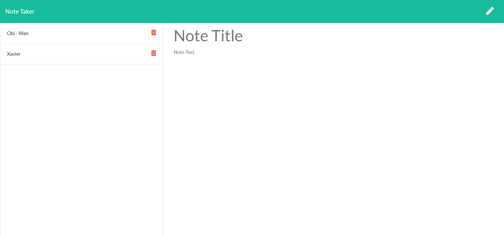
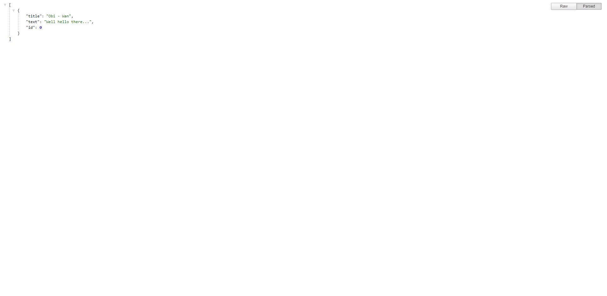

# Note Taker
  

  # Table of Contents:

  1. [Description](#description)
  2. [Installation Process](#installation-process)
  3. [Usage](#usage)
  4. [License](#license)
  5. [Contributors](#contributors)
  6. [Testing](#testing)
  7. [Github Username](#github-username)
  8. [Email Address](#email-address)
  9. [Examples](#examples)

## Questions:
- Contact Me:
  - If you have any questions about the application please email me at guzmanxavi112@gmail.com.
  - Here you can find my Github page [XavierG13](https://github.com/XavierG13)

## Description:
  Note Taker will take in user input to create, save, and also delete notes.

## Installation Process:
  npm install, npm i express, npm i path

## Usage:
  This project is for someone to use a simple application that will allow them to create a new note on a local server. They then can add any additional notes for themselves. When they user is done they can then delete the notes that they no longer need. The app will add new notes to the api list and also remove them when user wants to delete the note.

## License:
  - This application is covered under the MIT license.
  
## Contributors:
  N/A

## Testing:
  No tests to run

### Github Username:
  XavierG13

### Email Address:
  guzmanxavi112@gmail.com

# Examples:

## Video:
- [Link to video](https://drive.google.com/file/d/1Qu3FTYZ484HJPazvtqVQ_n7zSMvAnrR4/view)

## Images:

### App Image

### API Table

